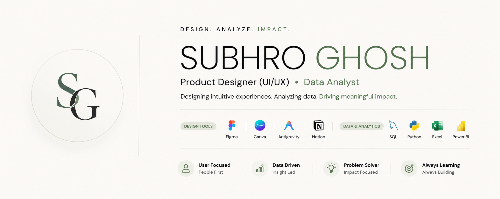

  

  

 

<h1 align="center">Hi 👋, I'm Subhro Ghosh</h1>

<h3 align="center">
Product Designer • Data Analyst • AI & ML Student
</h3>

Designing intuitive digital experiences while uncovering meaningful insights through data.

---

# 👨🏻‍💻 About Me

- 🎓 B.Tech Computer Science Engineering (AI & ML)
- 🎨 Product Designer passionate about crafting intuitive, user-centric digital experiences
- 📊 Aspiring Data Analyst building data-driven solutions with SQL, Python, Excel & Power BI
- 🚀 Building real-world products and analytics projects
- 🌱 Constantly learning, experimenting and improving through hands-on work
- 💼 Open to Product Design, UI/UX and Data Analytics opportunities

---

# 🚀 Expertise

<table>
<tr>

<td width="50%" valign="top">

### 🎨 Product Design

- User Research
- Information Architecture
- Wireframing
- Prototyping
- Design Systems
- Usability Testing

</td>

<td width="50%" valign="top">

### 📊 Data Analytics

- SQL
- Python
- Excel
- Power BI
- Pandas
- NumPy

</td>

</tr>
</table>

---

# 🛠️ Tech Stack

### 🎨 Design

  
  
  
  

### 📊 Data Analytics

---

# 🎯 Current Focus

- 🎨 Designing impactful digital experiences
- 📊 Building end-to-end Data Analytics projects
- 📈 Strengthening SQL, Python & Power BI skills
- 🤖 Exploring AI-powered digital products
- 🤝 Open to internships and collaborations

---

# 📌 Featured Projects

## 🎨 Product Design

| Project | Description | Link |
|----------|-------------|------|
| 🚀 **VAYO** | Designed product experiences during my Product Design Internship at **Laneway India** for **VAYO**, a community-first social platform focused on meaningful connections. | 🌐 [Explore Project](https://www.askvayo.com) |
| 💸 **FLOWFI** | A modern personal finance platform focused on budgeting, expense tracking and actionable financial insights. | 📄 [View Case Study](https://dramatic-lyre-4ea.notion.site/FlowFi-Personal-Finance-UX-Case-Study-3390d6817a4380298125d7fd2297dedb?source=copy_link) |
| 🛠 **ISSUEFLOW** | AI-powered issue tracking and campus maintenance platform designed to improve collaboration and workflow efficiency. | 📄 [View Case Study](https://dramatic-lyre-4ea.notion.site/IssueFlow-AI-Powered-Campus-Maintenance-System-Case-Study-34b0d6817a438094a795e1f6234c9879?source=copy_link) |

---

## 📊 Data Analytics

| Project | Description | Repository |
|----------|-------------|------------|
| 📈 **World Layoffs Data Cleaning** | Cleaned and standardized a real-world layoffs dataset using SQL through duplicate removal, null handling, data transformation and standardization. | 💻 [GitHub Repository](https://github.com/Subhro27/WORLD_LAYOFFS_DATA_CLEAN_SQL) |

---

# 🔥 GitHub Streak

---

# 📫 Let's Connect

---

<h3 align="center">

✨ Design with empathy. Analyze with purpose. Build with impact.

</h3>

## 🐍 Contribution Snake

  

